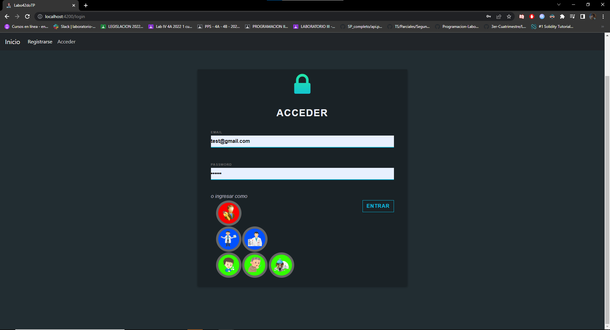
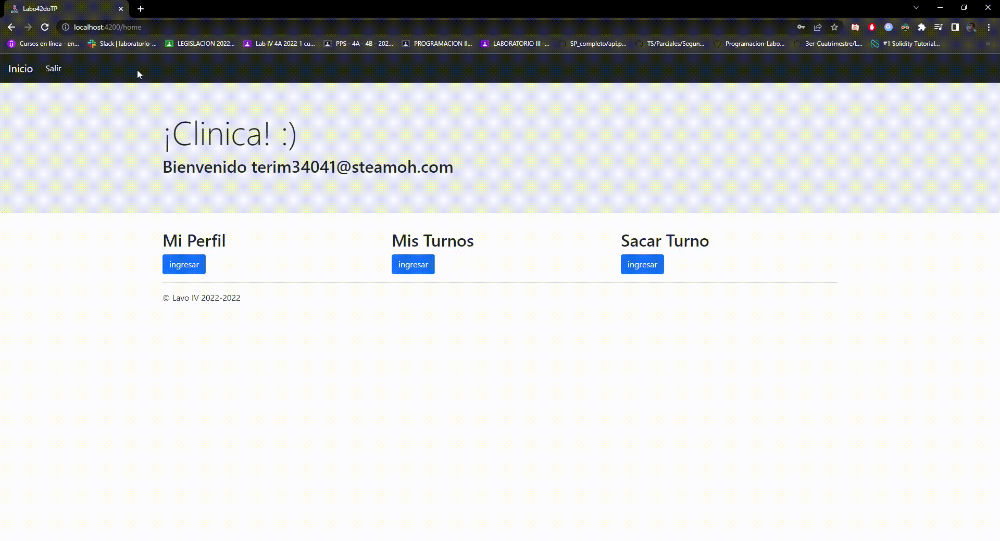
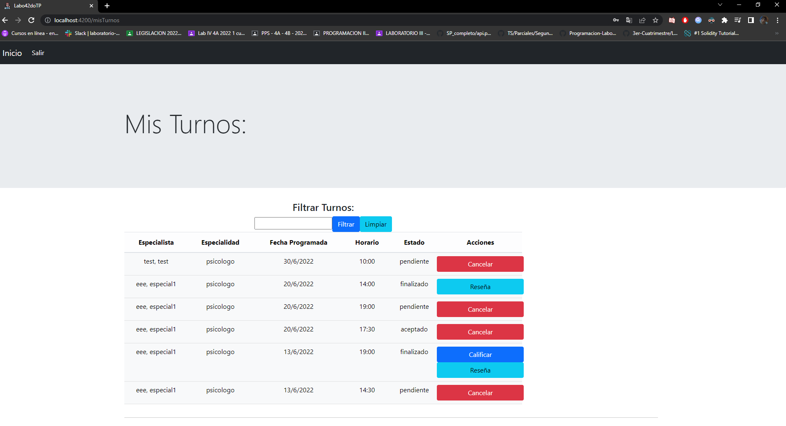

# Labo4 TP Clinica

Puede ver la pagina ingresando en: [TP Clinica Alexis Rodriguiez](https://labo4-tp2.herokuapp.com/home).

## Login

En esta página un usuario ingresa, con su cuenta correspondiente y en caso de ser correcta, ingresa al home.

## Registro

Cualquier usuario puede ingresar a esta página para poder crear una cuenta para poder ingresar a la página de la clínica, cumpliendo
ciertos requisitos, según el perfil del usuario.

## Sacar turno

El paciente o administrador pueden pedir un turno para una determinada especialidad, especialista, día y hora.

## Mis turnos

Para los pacientes pueden ver los turnos que pidieron, teniendo la posibilidad de cancelarlo y ver la reseña, en el caso de que la tenga.
Y para los especialistas, controlan los turnos que fueron de sus pacientes, los cuales pueden aceptar, rechazar, cancelar o finalizar.

## Mi perfil

En esta página, se mostraran todos los detalles del paciente, en caso de ser especielista, se mostraran sus dias y horarios disponibles, permitiendo que se cambien

## Turnos (Admin)

Solo podra ingresar el administrador, donde puede ver TODOS los turnos, pudiendo cancelarlos.

## Usuarios (Admin)

Solo podra ingresar el administrador, se muestra un listado de todos los usuarios, se da la opcion para poder activar las cuentas de los
especialistas.
